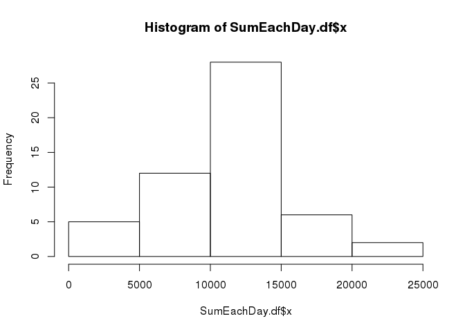
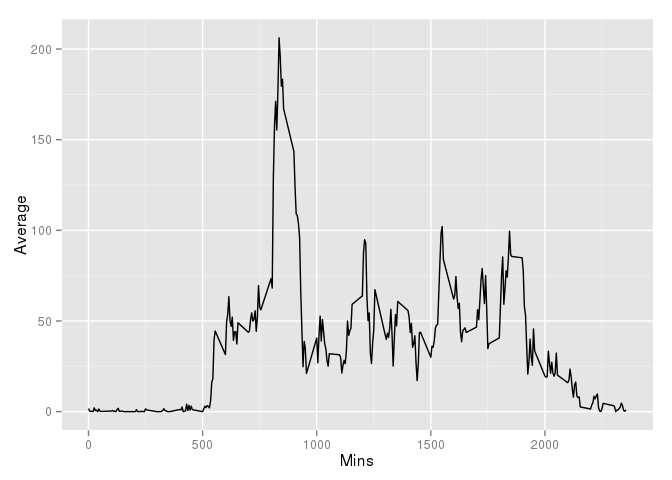
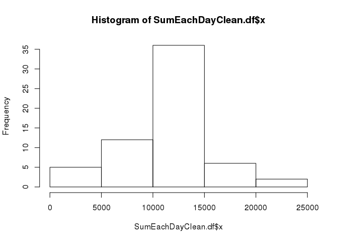
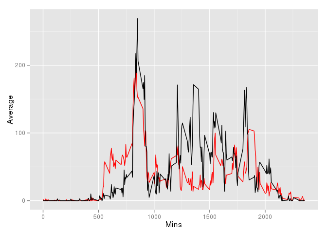

# Reproducible Research: Peer Assessment 1


## Loading and preprocessing the data


```r
mydata.df=read.csv("./activity.csv",header=T,
	colClasses=c("integer","Date","integer"))
SumEachDay.df=aggregate(mydata.df$steps,by=list(Day=mydata.df$date),FUN=sum)
```

##
## What is mean total number of steps taken per day?
##
Below is the table for mean & median for number of step taken each day:
 

## What is the average daily activity pattern?

Below is the table for mean & median for number of step taken each day:

```r
MeanMedian.df=mydata.df %>% 
	group_by (date) %>% 
	summarise(mean=mean(steps,na.rm=T), median=median(steps,na.rm=T))
MeanMedian.df
```

```
## Source: local data frame [61 x 3]
## 
##          date     mean median
## 1  2012-10-01       NA     NA
## 2  2012-10-02  0.43750      0
## 3  2012-10-03 39.41667      0
## 4  2012-10-04 42.06944      0
## 5  2012-10-05 46.15972      0
## 6  2012-10-06 53.54167      0
## 7  2012-10-07 38.24653      0
## 8  2012-10-08      NaN     NA
## 9  2012-10-09 44.48264      0
## 10 2012-10-10 34.37500      0
## ..        ...      ...    ...
```

Below is the plot with Ave number of steps vs 5 mins interval:

```r
MeanFiveMinutes=mydata.df %>% group_by (interval) %>% summarise(average=mean(steps,na.rm=T))
ggplot(data=MeanFiveMinutes) + geom_line(aes(x = interval, y = average)) + xlab('Mins') + ylab('Average')
```

 


```r
myinterval=subset(MeanFiveMinutes, average==max(MeanFiveMinutes$average),
        select=interval)
```
835 is the max number of steps.

##
## Inputing missing values
##

Total number of missing values in the dataset is 2304.


```r
library(reshape)
mydataCast.df=cast(mydata.df,date~interval,value="steps")

for (x in 1:nrow(mydataCast.df)){
        myvalue = as.numeric(mydataCast.df[x,-1])
        myvalue[is.na(myvalue)] = MeanFiveMinutes$average
        mydataCast.df[x,-1] <- myvalue
}
```

The NA value in dataset are replaced with 5mins interval  mean value.


```r
SumEachDayClean.df=aggregate(mydataClean.df$steps, by=list(Day=mydataClean.df$date),FUN=sum)
ReportClean=mydataClean.df %>% group_by (date) %>% summarise(mean=mean(steps,na.rm=T), median=median(steps,na.rm=T))
```

##Below is the table for mean & median for each day with NA "cleaned" based on above strategy:
 

Below is the table for mean & median for number of step taken each day with NA filled up based on above strategy :

```r
ReportClean.df=mydataClean.df %>% group_by (date) %>% summarise(mean=mean(steps,na.rm=T), median=median(steps,na.rm=T))
ReportClean.df
```

```
## Source: local data frame [61 x 3]
## 
##          date     mean   median
## 1  2012-10-01 37.38260 34.11321
## 2  2012-10-02  0.43750  0.00000
## 3  2012-10-03 39.41667  0.00000
## 4  2012-10-04 42.06944  0.00000
## 5  2012-10-05 46.15972  0.00000
## 6  2012-10-06 53.54167  0.00000
## 7  2012-10-07 38.24653  0.00000
## 8  2012-10-08 37.38260 34.11321
## 9  2012-10-09 44.48264  0.00000
## 10 2012-10-10 34.37500  0.00000
## ..        ...      ...      ...
```


 

# Are there differences in activity patterns between weekdays and weekends?
# 
## From the graph, there are high mean steps between 0500 - 1000 on weekday. After 1000 onwards,  there are more steps taken over weekend.
